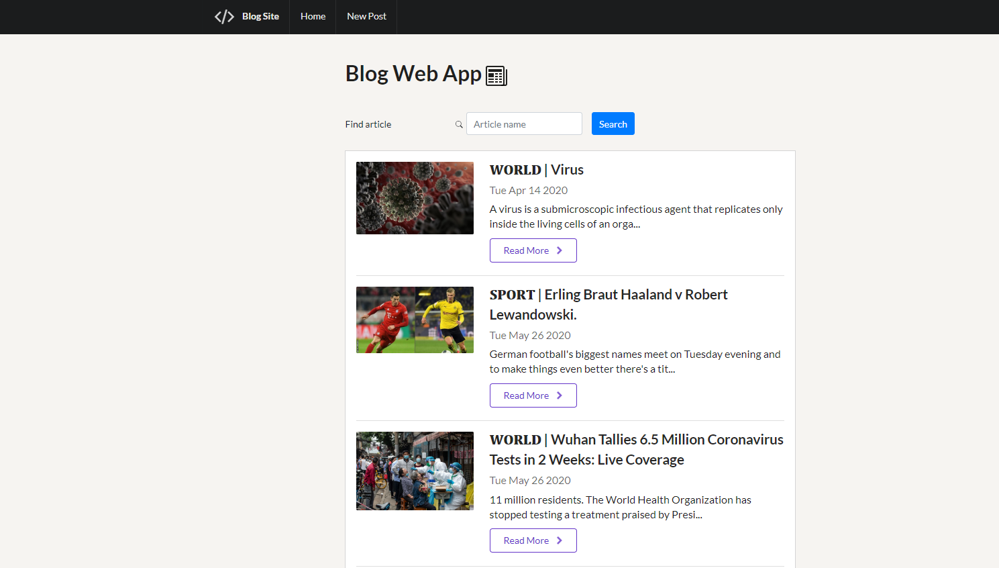
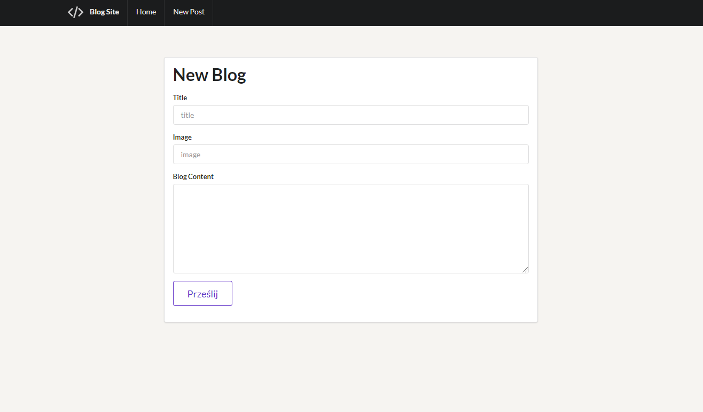

# Blog_app

## Simple BlogApp running on Node.js and Express Framework

### In this Web Application we can add a new articles, we edits a Blog Content, Titles and Images.

 

#

#

#

# Built with: 

## Backend
### Javascript
### Node.js
### Express
### MongoDB

## Frontend
### Bootstrap
### Semantic UI

## IDE
### Visual Studio Code

